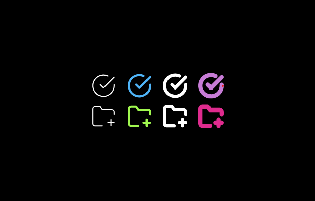

# flet-svgicon

A lightweight custom control for [Flet](https://flet.dev/) that makes it easy to display and customize **SVG icons** directly from Python.  
Easily change **stroke color**, **fill color**, **size**, and **stroke width** of your SVGs in real time.

---

## ✨ Features
- 🎨 Customize **stroke color**, **fill color**, **size**, and **stroke width** from Python code
- ⚡ Simple API for quick integration into any Flet page
- 📁 Supports local SVG assets
- 🖥️ Works across platforms (desktop, web, mobile)

---
## 📸 Preview


## Clone the repo and Test:
```bash
git clone https://github.com/navideveloper/flet-svgicon.git
cd flet-svgicon
python example.py
```